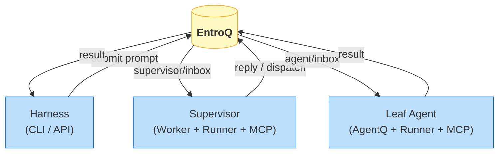
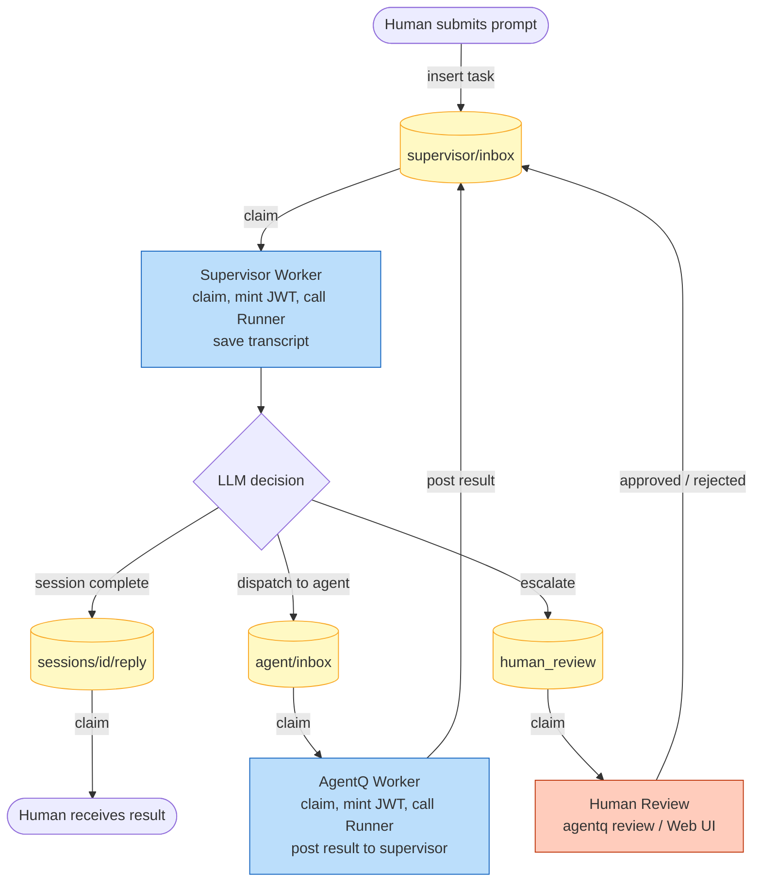

# AgentQ

Multi-agent orchestration built on security fundamentals that distributed
systems worked out decades ago — least privilege, decomposition, explicit
delegation, auditable communication paths — applied to AI agents.

https://highentropy.com/posts/agentq-learnings/

> **Status: experimental.** APIs and config formats will change.

---

## Why do I care?

Most agent frameworks give agents *ambient authority*: the agent process can
do whatever the host process can do. The LLM gets a bag of tools, and the
only thing standing between a crafted prompt and a filesystem wipe is a
system prompt within a finite and floodable context window.

This quietly reproduces the security failures that operating systems and
distributed systems spent thirty years fixing. AgentQ applies the correct
baseline instead:

- **Least privilege** — each agent gets exactly the tools its role needs,
  enforced cryptographically by a signed JWT, not by convention.
- **Decomposition** — supervisor, agents, runner, and tool server are separate
  processes with separate identities. The blast radius of a compromised or
  prompt-injected agent is bounded by construction.
- **Auditable communication** — every inter-component message travels through
  a durable queue (EntroQ). The communication topology is declarative and
  visible. Nothing talks to anything that isn't in the graph. All agent
  participation is traceable.
- **Explicit delegation** — every agent action traces back to a human
  authorization decision through a signed delegation chain (RFC 8693). The
  supervisor dispatches work, not trust.

Agents still do capable, emergent work within this structure. Security and
capability are not at odds. You just have to build the structure first.

---

## Architecture

Solid edges travel through the queue; dashed edges are direct HTTP.
High-fidelity Graphviz source: [`docs/architecture.dot`](docs/architecture.dot) and [`docs/flow.dot`](docs/flow.dot).



### Component roles

**EntroQ** — the [durable task queue](https://github.com/shiblon/entroq). Every
message between components is a task on a named queue. There are no direct
connections, no ambient channels. The queue topology *is* the communication
graph, and it is auditable.

**Supervisor Worker** — the orchestration brain. It owns a long-running
conversation, decides what to delegate, and is the only component that sees
both the original user intent and each agent's output simultaneously. Agents
cannot talk to each other directly; everything routes through the supervisor.

**AgentQ Worker** — a thin relay for one named agent role (e.g., `coder`,
`researcher`). Claims tasks from its inbox, mints a per-task JWT capped to
the agent's configured tool ceiling, calls the runner, posts the result back
to the supervisor.

**Runner** — a minimal HTTP microservice. Accepts a JWT and a message
transcript, writes an MCP config file, execs the configured LLM command
(default: `claude --print`), and returns the output. Knows nothing about
queues or orchestration.

**MCP Server** — the capability enforcer. A stateless HTTP pool. Every
request carries a signed JWT specifying which tools are allowed and which
filesystem path is in scope. The server validates the JWT and filters the
tool list accordingly. No JWT, no tools; a forged or expired JWT changes
nothing.

### Request flow

A single session moves through the system as follows. The supervisor loop
repeats until the LLM decides the work is done or escalates for human review.



---

## Security principles

### Decomposition

Supervisor, leaf agents, runner, and tool server are separate processes with
independent network identities. A compromised or prompt-injected agent cannot
reach the supervisor queue, cannot see other sessions, and cannot escalate to
tools outside its JWT-granted set. Each component has the minimum surface
area needed to do its job.

### Sandboxing: MCP as chroot

The MCP server is the agent's entire capability surface. Agents have no
direct filesystem, network, or subprocess access — only what MCP exposes.
The JWT carries the working directory and tool allowlist; MCP prepends the
working directory to every file operation and rejects path traversal. The
container image is the outer boundary (what binaries can exist); MCP is the
inner boundary (what the agent can ask for at runtime).

### Strong boundaries with explicit issuance

Tool access is cryptographic, not conventional. The JWT is signed by the
component that minted it (Supervisor or AgentQ Worker). The MCP server holds
only the public key and cannot mint. An agent cannot expand its own tool set
by asking for more in the prompt. The JWT `ToolAllowlist` is the ceiling;
no handler outside it is reachable.

### Delegation chain (RFC 8693)

Every agent JWT carries a delegation claim tracing back to the human session
that triggered the work. Decode any agent JWT mid-session and you see the
chain of custody: human → supervisor → agent. Authorization is grounded in
the original user's intent, not just the most recent task hop.

### Least-privilege routing

The queue topology enforces communication privilege. Only the supervisor can
insert into agent inboxes. Agents post results only to the supervisor inbox.
No agent can claim from another agent's queue. In a production deployment
this is enforced at the queue ACL layer (OPA policy on EntroQ), not by
application convention.

---

## Getting started

### Prerequisites

- Go 1.22+
- `claude` CLI (or any LLM subprocess tool you prefer)

### Build

```bash
git clone https://github.com/shiblon/agentq
cd agentq
go build -o agentq ./cmd/agentq
```

### 1. Start the queue server

```bash
docker run --rm -p 37706:37706 ghcr.io/shiblon/entroq-mem:v1.0.1 serve
```

### 2. Generate signing keys

```bash
./agentq mcp keygen --out-dir keys/
# writes keys/private.jwk (workers) and keys/public.jwks (MCP server)
```

### 3. Start the MCP server

```bash
./agentq mcp serve \
  --jwks-file keys/public.jwks \
  --issuer agentq \
  --eq-addr localhost:37706             # enables dispatch_to_agent
```

### 4. Start the runner

```bash
./agentq runner serve \
  --mcp-addr http://localhost:8081
```

### 5. Start the supervisor

```bash
./agentq supervisor serve \
  --runner-url http://localhost:8082 \
  --mcp-addr  http://localhost:8081 \
  --key-file  keys/private.jwk
```

### 6. Start an agent worker

```bash
./agentq worker serve \
  --agent    coder \
  --key-file keys/private.jwk
# reads runner_url and mcp_addr from agents.yaml
```

### 7. Submit a prompt

```bash
./agentq submit --prompt "Refactor the auth module to use JWT."
```

`submit` blocks until the supervisor's reply arrives, then prints it. Use
`--continue-from <session-id>` to chain sessions and inherit prior artifacts.

### Human review

When the supervisor escalates based on the rubric, the session enters
`awaiting_review`. Process the queue interactively:

```bash
./agentq review
```

### Development shortcut

For local experimentation, skip key generation entirely:

```bash
# MCP server: parse JWTs but skip signature verification
./agentq mcp serve --insecure-skip-verification --eq-addr localhost:37706

# Workers: generate an ephemeral key at startup
./agentq supervisor serve --insecure-no-keys --runner-url ... --mcp-addr ...
./agentq worker serve     --insecure-no-keys --agent coder
```

SIGHUP reloads the signing key on any component that holds one, compatible
with Vault Agent–style credential rotation.

---

## Configuration reference

### agents.yaml

```yaml
# Rubric governs supervisor escalation decisions.
rubric: |
  Auto-approve read-only actions (file reads, searches, web lookups).
  Escalate writes to the filesystem or any shell command that modifies state.
  Always reject requests to delete files or run destructive commands.

agents:
  - name: coder
    description: Writes and edits code based on a task description.
    runner_url: http://localhost:8082
    mcp_addr:   http://localhost:8081
    tools:
      - read_file
      - write_file
      - git_status
      - git_diff
      - search_files
    # tools: ["*"] grants all file tools
```

#### Agent fields

| Field | Description |
|---|---|
| `name` | Short identifier, e.g. `coder`. Used as the queue name (`agentq/<name>/inbox`). |
| `description` | One-line description passed to the supervisor as context. |
| `runner_url` | HTTP URL of the runner microservice for this agent. |
| `mcp_addr` | HTTP URL of the MCP pool server. |
| `tools` | Tool ceiling: list of MCP tool names, or `["*"]` for all file tools. Absent or empty means no tools (fail-closed). |

### Global flags (all commands)

| Flag | Env var | Default | Description |
|---|---|---|---|
| `--eq-addr` | `AGENTQ_EQ_ADDR` | `localhost:37706` | EntroQ gRPC server address |
| `--config` | `AGENTQ_CONFIG` | `agents.yaml` | Path to agents config file |

---

## Known gaps

The security architecture is structurally correct; some bones are still being
added:

- **Queue ACLs** — enforced in Zitadel-backed and Kubernetes deployments;
  unenforced on the bare dev path (any process can claim any queue locally).
- **Per-invocation scoping** — agent tool sets are per-type, not
  per-invocation. The same JWT ceiling applies to a one-liner fix and a full
  refactor. RFC 9396 (RAR) is the path to task-specific narrowing.
- **Artifact signing** — absent; an attacker with queue write access could
  inject results. Macaroons (Google 2014) are the targeted fix.
- **Workload attestation** — for non-Kubernetes deployments a compromised
  process can self-identify as any agent type. SPIFFE/SPIRE is the documented
  path; the Kubernetes deployment closes this via ServiceAccount-bound JWTs.

These are documented gaps with known remediation paths, not surprises. The
honest claim: structural enforcement is in place for the components that
matter most; the remaining gaps have clear solutions and are not blockers for
running AgentQ in a trusted environment.
